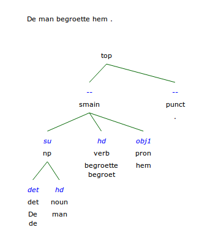

.. DO NOT REMOVE ANY foliaspec COMMENTS NOR EDIT THE TEXT BLOCK IMMEDIATELY FOLLOWING SUCH COMMENTS! THEY WILL BE AUTOMATICALLY UPDATED BY THE foliaspec TOOL!

.. _dependency_annotation:

Dependency Annotation
==================================================================

.. foliaspec:annotationtype_description(dependency)
Dependency relations are syntactic relations between spans of tokens. A dependency relation takes a particular class and consists of a single head component and a single dependent component.

Specification
---------------

.. foliaspec:specification(dependency)
:Annotation Category: :ref:`span_annotation_category`
:Declaration: ``<dependency-annotation set="...">`` *(note: set is optional for this annotation type; if you declare this annotation type to be setless you can not assign classes)*
:Version History: Slightly revised since v0.8 (no ``su`` attribute on ``hd``/``dep``)
:**Element**: ``<dependency>``
:API Class: ``Dependency`` (`FoLiApy API Reference <https://foliapy.readthedocs.io/en/latest/_autosummary/folia.main.Dependency.html>`_)
:Layer Element: ``<dependencies>``
:Span Role Elements: ``<dep>`` (``DependencyDependent``), ``<hd>`` (``Headspan``)
:Required Attributes: 
:Optional Attributes: * ``xml:id`` -- The ID of the element; this has to be a unique in the entire document or collection of documents (corpus). All identifiers in FoLiA are of the `XML NCName <https://www.w3.org/TR/1999/WD-xmlschema-2-19990924/#NCName>`_ datatype, which roughly means it is a unique string that has to start with a letter (not a number or symbol), may contain numers, but may never contain colons or spaces. FoLiA does not define any naming convention for IDs.
                      * ``set`` -- The set of the element, ideally a URI linking to a set definition (see :ref:`set_definitions`) or otherwise a uniquely identifying string. The ``set`` must be referred to also in the :ref:`annotation_declarations` for this annotation type.
                      * ``class`` -- The class of the annotation, i.e. the annotation tag in the vocabulary defined by ``set``.
                      * ``processor`` -- This refers to the ID of a processor in the :ref:`provenance_data`. The processor in turn defines exactly who or what was the annotator of the annotation.
                      * ``annotator`` -- This is an older alternative to the ``processor`` attribute, without support for full provenance. The annotator attribute simply refers to the name o ID of the system or human annotator that made the annotation.
                      * ``annotatortype`` -- This is an older alternative to the ``processor`` attribute, without support for full provenance. It is used together with ``annotator`` and specific the type of the annotator, either ``manual`` for human annotators or ``auto`` for automated systems.
                      * ``confidence`` -- A floating point value between zero and one; expresses the confidence the annotator places in his annotation.
                      * ``datetime`` -- The date and time when this annotation was recorded, the format is ``YYYY-MM-DDThh:mm:ss`` (note the literal T in the middle to separate date from time), as per the XSD Datetime data type.
                      * ``n`` -- A number in a sequence, corresponding to a number in the original document, for example chapter numbers, section numbers, list item numbers. This this not have to be an actual number but other sequence identifiers are also possible (think alphanumeric characters or roman numerals).
                      * ``textclass`` -- Refers to the text class this annotation is based on. This is an advanced attribute, if not specified, it defaults to ``current``. See :ref:`textclass_attribute`.
                      * ``src`` -- Points to a file or full URL of a sound or video file. This attribute is inheritable.
                      * ``begintime`` -- A timestamp in ``HH:MM:SS.MMM`` format, indicating the begin time of the speech. If a sound clip is specified (``src``); the timestamp refers to a location in the soundclip.
                      * ``endtime`` -- A timestamp in ``HH:MM:SS.MMM`` format, indicating the end time of the speech. If a sound clip is specified (``src``); the timestamp refers to a location in the soundclip.
                      * ``speaker`` -- A string identifying the speaker. This attribute is inheritable. Multiple speakers are not allowed, simply do not specify a speaker on a certain level if you are unable to link the speech to a specific (single) speaker.
:Accepted Data: ``<comment>`` (:ref:`comment_annotation`), ``<desc>`` (:ref:`description_annotation`), ``<metric>`` (:ref:`metric_annotation`), ``<relation>`` (:ref:`relation_annotation`)
:Valid Context: ``<dependencies>`` (:ref:`dependency_annotation`)

Explanation
-------------------------

.. note::

    Please first ensure you are familiar with the general principles of :ref:`span_annotation_category` to make sense of this annotation type.

Dependency relations are syntactic relations between spans of tokens. A dependency relation takes a particular class and
consists of a single head component and a single dependent component. In the
sample *"He sees"*, there is  syntactic dependency between the two words:
*"sees"* is the head, and *"He"* is the dependant, and the relation can be qualified as
something like *subject*, as the dependant is the subject of the head word.
Each dependency relation is explicitly noted in FoLiA.

The element ``<dependencies>`` introduces this annotation layer. Within it,
``<dependency>`` elements describe all dependency pairs.
The ``<dependency>`` element always contains two *span roles*: one
head element (``<hd>``) and one dependent element (``<dep>``). Within these span roles, the words
referenced in the usual stand-off fashion, using ``<wref>``.

Example
-------------------------

In the example below, we show a Dutch sentence parsed with the Alpino Parser.

For a better understanding, The following figure illustrates the syntactic parse with the dependency relations (blue).

We show not only the dependency layer, but also the syntax layer (:ref:`syntax_annotation`)
to which it is related.

.. literalinclude:: ../../examples/dependencies.2.0.0.folia.xml
    :linenos:
    :language: xml

