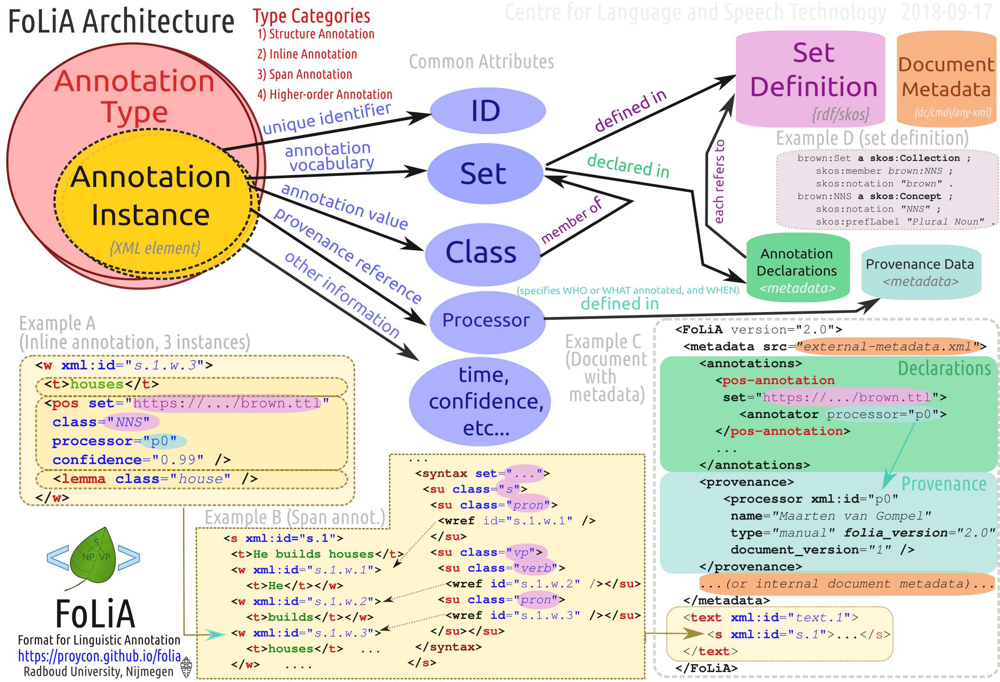

.. _introduction:

Introduction
================

.. foliaspec:version
.. The FoLiA version
version: 2.0.0

FoLiA, an acronym for **Format for Linguistic Annotation**, is a data model and file format to represent digitised
language resources enriched with linguistic annotation, e.g. linguistically enriched textual documents or transcriptions
of speech. The format is intended to provide a standard for the storage and exchange of such language resources,
including corpora and promote interoperability amongst Natural Language Processing tools that use the format.

Our aim is to introduce a single rich format that can accommodate a wide variety of linguistic annotation types through
a single generalised paradigm. We do not commit to any label/vocabulary set, language or linguistic theory.  This is
always left to the developer of the language resources, and provides maximum flexibility. We merely specify the broad
category of annotation types and provide other mechanisms that allow resource constructors to formalize vocabulary sets.

FoLiA has the following characteristics:

* **Expressive**: The format is highly expressive, annotations can be expressed in great detail and with flexibility to the user's needs, without forcing unwanted details. Moreover, FoLiA has generalised support for representing annotation alternatives, and annotation metadata such as information on annotator, time of annotation, and annotation confidence.
* **Generic** - We apply the same paradigm to a wide variety of annotation types, assuring a uniform and consistent way of representing different annotation.
* **Specific** - FoLiA very explicitly defines various annotation types. This means it choses *not* to subscribe to a looser
  paradigm where users themselves can invent their annotation types, but keeps this centralised to promote compliance to
  a more rigid structure. This ensures that any FoLiA-capable tools know what to expect.
* **Formalised** - The format is formalised, and can be validated on both a shallow and a deep level (the latter including tagset validation), and easily machine parsable, for which tools are provided.
* **Practical** - FoLiA has been developed in a bottom-up fashion right alongside applications, programming libraries, and other toolkits and converters. Whilst the format is rich, we try to maintain it as simple and straightforward as possible, minimising the learning curve and making it easy to adopt FoLiA in practical applications.

The FoLiA format is XML-based and makes mixed use of inline and stand-off annotation. XML is an inherently hierarchic
format and FoLiA does justice to this by utilising a hierarchic, inline, setup where possible. Inline annotation is used
for annotations pertaining to singular structural elements such as words/tokens, whilst stand-off annotation in separate
annotation layers is adopted for annotation types that span over multiple structural elements.

FoLiA favours a **single-document** approach, meaning that a text and all linguistic annotations on that text are stored
in a single XML file. This facilitates keeping all annotation layers in sync with eachother and prevents incomplete or
loss of information. The single-document approach is not just limited to the annotation and text, but also encompasses
the document structure and document mark-up (e.g. basic text styling). Nevertheless, there exists a FoLiA mechanism that
does allow you to take a more stand-off approach and store annotations in separate external FoLiA documents if
absolutely needed.

This documentation is limited to describing, in great detail, how FoLiA works, for more about the motivation behind the
construction of FoLiA and how it compares to somewhat similar or comparable initiatives such as `TEI
<http://tei-c.org>`_, LAF .. , `TCF <https://weblicht.sfs.uni-tuebingen.de/weblichtwiki/index.php/The_TCF_Format>`_,
NAF, Paula XML, Tiger XML, and others, we refer you to our research paper providing a descriptive and comparative study
[vanGompel2014]_ .

.. [vanGompel2014] Maarten van Gompel & Martin Reynaert (2014). FoLiA: A practical XML format for linguistic annotation - a descriptive and comparative study; Computational Linguistics in the Netherlands Journal; 3:63-81; 2013. `(PDF) <http://www.clinjournal.org/sites/clinjournal.org/files/05-vanGompel-Reynaert-CLIN2013.pdf>`_ `(BibTeX) <http://www.clinjournal.org/biblio/export/bibtex/39>`_

Annotation Types
---------------------------

FoLiA defines various XML elements to represent document structure and various annotations, we can divide these XML
elements into several generic annotation groups. In each of these categories, FoLiA defines specific elements for
specific annotation types. This is a deliberate limit on the extensibility of FoLiA in favour of specificity; i.e. you
can't just add your own annotation type. If a particular annotation type is not properly accommodated yet, contact the
FoLiA developers and we will see how we can extend FoLiA.

For good measure, we again emphasise that this is a limitation on annotation types only, not on the vocabulary the
annotation types make use of, which is deliberately separated from the FoLiA standard itself. The next section will
elaborate on this.

Below are the categories and underlying annotation types, you can click each for exhaustive information (but please
finish this introductory chapter first):

.. DO NOT EDIT ANYTHING IN THE TABLE OF CONTENTS BLOCK! IT IS AUTO-GENERATED BY foliaspec!

.. foliaspec:toc
* :ref:`structure_annotation_category` --
  This category encompasses annotation types that define the structure of a document, e.g. paragraphs, sentences, words, sections like chapters, lists, tables, etc... These types are not strictly considered linguistic annotation and equivalents are also commonly found in other document formats such as HTML, TEI, MarkDown, LaTeX, and others. For FoLiA it provides the necessary structural basis that linguistic annotation can build on.
   - :ref:`token_annotation` -- ``<w>`` -- This annotation type introduces a tokenisation layer for the document. The terms **token** and **word** are used interchangeably in FoLiA as FoLiA itself does not commit to a specific tokenisation paradigm. Tokenisation is a prerequisite for the majority of linguistic annotation types offered by FoLiA and it is one of the most fundamental types of Structure Annotation. The words/tokens are typically embedded in other types of structure elements, such as sentences or paragraphs.
   - :ref:`division_annotation` -- ``
`` -- Structure annotation representing some kind of division, typically used for chapters, sections, subsections (up to the set definition). Divisions may be nested at will, and may include almost all kinds of other structure elements.
   - :ref:`paragraph_annotation` -- ``
`` -- Represents a paragraph and holds further structure annotation such as sentences.
   - :ref:`head_annotation` -- ``<head>`` -- The ``head`` element is used to provide a header or title for the structure element in which it is embedded, usually a division (``
``)
   - :ref:`list_annotation` -- ``<list>`` -- Structure annotation for enumeration/itemisation, e.g. bulleted lists.
   - :ref:`figure_annotation` -- ``<figure>`` -- Structure annotation for including pictures, optionally captioned, in documents.
   - :ref:`whitespace_annotation` -- ``<whitespace>`` -- Structure annotation introducing vertical whitespace
   - :ref:`linebreak_annotation` -- `` `` -- Structure annotation representing a single linebreak and with special facilities to denote pagebreaks.
   - :ref:`sentence_annotation` -- ``<s>`` -- Structure annotation representing a sentence. Sentence detection is a common stage in NLP alongside tokenisation.
   - :ref:`event_annotation` -- ``<event>`` -- Structural annotation type representing events, often used in new media contexts for things such as tweets, chat messages and forum posts (as defined by a user-defined set definition). Note that a more linguistic kind of event annotation can be accomplished with `Entity Annotation` or even `Time Segmentation` rather than this one.
   - :ref:`quote_annotation` -- ``<quote>`` -- Structural annotation used to explicitly mark quoted speech, i.e. that what is reported to be said and appears in the text in some form of quotation marks.
   - :ref:`note_annotation` -- ``<note>`` -- Structural annotation used for notes, such as footnotes or warnings or notice blocks.
   - :ref:`reference_annotation` -- ``<ref>`` -- Structural annotation for referring to other annotation types. Used e.g. for referring to bibliography entries (citations) and footnotes.
   - :ref:`table_annotation` -- ``<table>`` -- Structural annotation type for creating a simple tabular environment, i.e. a table with rows, columns and cells and an optional header.
   - :ref:`part_annotation` -- ``<part>`` -- The structure element ``part`` is a fairly abstract structure element that should only be used when a more specific structure element is not available. Most notably, the part element should never be used for representation of morphemes or phonemes! Part can be used to divide a larger structure element, such as a division, or a paragraph into arbitrary subparts.
   - :ref:`utterance_annotation` -- ``<utt>`` -- An utterance is a structure element that may consist of words or sentences, which in turn may contain words. The opposite is also true, a sentence may consist of multiple utterances. Utterances are often used in the absence of sentences in a speech context, where neat grammatical sentences can not always be distinguished.
   - :ref:`entry_annotation` -- ``<entry>`` -- FoLiA has a set of structure elements that can be used to represent collections such as glossaries, dictionaries, thesauri, and wordnets. `Entry annotation` defines the entries in such collections, `Term annotation` defines the terms, and `Definition Annotation` provides the definitions.
   - :ref:`term_annotation` -- ``<term>`` -- FoLiA has a set of structure elements that can be used to represent collections such as glossaries, dictionaries, thesauri, and wordnets. `Entry annotation` defines the entries in such collections, `Term annotation` defines the terms, and `Definition Annotation` provides the definitions.
   - :ref:`definition_annotation` -- ``<def>`` -- FoLiA has a set of structure elements that can be used to represent collections such as glossaries, dictionaries, thesauri, and wordnets. `Entry annotation` defines the entries in such collections, `Term annotation` defines the terms, and `Definition Annotation` provides the definitions.
   - :ref:`example_annotation` -- ``<ex>`` -- FoLiA has a set of structure elements that can be used to represent collections such as glossaries, dictionaries, thesauri, and wordnets. `Examples annotation` defines examples in such collections.
   - :ref:`hyphenation_annotation` -- ``<t-hbr>`` -- This is a text-markup annotation form that indicates where in the original text a linebreak was inserted and a word was hyphenised.
   - :ref:`hiddentoken_annotation` -- ``<hiddenw>`` -- This annotation type allows for a hidden token layer in the document. Hidden tokens are ignored for most intents and purposes but may serve a purpose when annotations on implicit tokens is required, for example as targets for syntactic movement annotation.
* :ref:`content_annotation_category` --
  This category groups text content and phonetic content, the former being one of the most frequent elements in FoLiA and used to associate text (or a phonetic transcription) with a structural element.
   - :ref:`text_annotation` -- ``<t>`` -- Text annotation associates actual textual content with structural elements, without it a document would be textless. FoLiA treats it as an annotation like any other.
   - :ref:`phon_annotation` -- ``<ph>`` -- This is the phonetic analogy to text content (``<t>``) and allows associating a phonetic transcription with any structural element, it is often used in a speech context. Note that for actual segmentation into phonemes, FoLiA has another related type: ``Phonological Annotation``
   - :ref:`rawcontent_annotation` -- ``<content>`` -- This associates raw text content which can not carry any further annotation. It is used in the context of :ref:`gap_annotation`
* :ref:`inline_annotation_category` --
  This category encompasses (linguistic) annotation types describing a single structural element. Examples are Part-of-Speech Annotation or Lemmatisation, which often describe a single token.
   - :ref:`pos_annotation` -- ``<pos>`` -- Part-of-Speech Annotation, one of the most common types of linguistic annotation. Assigns a lexical class to words.
   - :ref:`lemma_annotation` -- ``<lemma>`` -- Lemma Annotation, one of the most common types of linguistic annotation. Represents the canonical form of a word.
   - :ref:`domain_annotation` -- ``<domain>`` -- Domain/topic Annotation. A form of inline annotation used to assign a certain domain or topic to a structure element.
   - :ref:`sense_annotation` -- ``<sense>`` -- Sense Annotation allows to assign a lexical semantic sense to a word.
   - :ref:`errordetection_annotation` -- ``<errordetection>`` -- This annotation type is deprecated in favour of `Observation Annotation` and only exists for backward compatibility.
   - :ref:`subjectivity_annotation` -- ``<subjectivity>`` -- This annotation type is deprecated in favour of `Sentiment Annotation` and only exists for backward compatibility.
   - :ref:`lang_annotation` -- ``<lang>`` -- Language Annotation simply identifies the language a part of the text is in. Though this information is often part of the metadata, this form is considered an actual annotation.
* :ref:`span_annotation_category` --
  This category encompasses (linguistic) annotation types that span one or more structural elements. Examples are (Named) Entities or Multi-word Expressions, Dependency Relations, and many others. FoLiA implements these as a stand-off layer that refers back to the structural elements (often words/tokens). The layer itself is embedded in a structural level of a wider scope (such as a sentence).
   - :ref:`syntax_annotation` -- ``<su>`` -- Assign grammatical categories to spans of words. Syntactic units are nestable and allow representation of complete syntax trees that are usually the result of consistuency parsing.
   - :ref:`chunking_annotation` -- ``<chunk>`` -- Assigns shallow grammatical categories to spans of words. Unlike syntax annotation, chunks are not nestable. They are often produced by a process called Shallow Parsing, or alternatively, chunking.
   - :ref:`entity_annotation` -- ``<entity>`` -- Entity annotation is a broad and common category in FoLiA. It is used for specifying all kinds of multi-word expressions, including but not limited to named entities. The set definition used determines the vocabulary and therefore the precise nature of the entity annotation.
   - :ref:`dependency_annotation` -- ``<dependency>`` -- Dependency relations are syntactic relations between spans of tokens. A dependency relation takes a particular class and consists of a single head component and a single dependent component.
   - :ref:`timesegment_annotation` -- ``<timesegment>`` -- FoLiA supports time segmentation to allow for more fine-grained control of timing information by associating spans of words/tokens with exact timestamps. It can provide a more linguistic alternative to `Event Annotation`.
   - :ref:`coreference_annotation` -- ``<coreferencechain>`` -- Relations between words that refer to the same referent (anaphora) are expressed in FoLiA using Coreference Annotation. The co-reference relations are expressed by specifying the entire chain in which all links are coreferent.
   - :ref:`semrole_annotation` -- ``<semrole>`` -- This span annotation type allows for the expression of semantic roles, or thematic roles. It is often used together with `Predicate Annotation`
   - :ref:`predicate_annotation` -- ``<predicate>`` -- Allows annotation of predicates, this annotation type is usually used together with Semantic Role Annotation. The types of predicates are defined by a user-defined set definition.
   - :ref:`observation_annotation` -- ``<observation>`` -- Observation annotation is used to make an observation pertaining to one or more word tokens.  Observations offer a an external qualification on part of a text. The qualification is expressed by the class, in turn defined by a set. The precise semantics of the observation depends on the user-defined set.
   - :ref:`sentiment_annotation` -- ``<sentiment>`` -- Sentiment analysis marks subjective information such as sentiments or attitudes expressed in text. The sentiments/attitudes are defined by a user-defined set definition.
   - :ref:`statement_annotation` -- ``<statement>`` -- Statement annotation, sometimes also refered to as attribution, allows to decompose statements into the source of the statement, the content of the statement, and the way these relate, provided these are made explicit in the text.
* :ref:`subtoken_annotation_category` --
  This category contains morphological annotation and phonological annotation, i.e. the segmentation of a word into morphemes and phonemes, and recursively so if desired. It is a special category that mixes characteristics from structure annotation (the ``morpheme`` and ``phoneme`` elements are very structure-like) and also from span annotation, as morphemes and phonemes are embedded in an annotation layer and refer back to the text/phonetic content they apply to. Like words/tokens, these elements may also be referenced from ``wref`` elements.
   - :ref:`morphological_annotation` -- ``<morpheme>`` -- Morphological Annotation allows splitting a word/token into morphemes, morphemes itself may be nested. It is embedded within a layer ``morphology`` which can be embedded within word/tokens.
   - :ref:`phonological_annotation` -- ``<phoneme>`` -- The smallest unit of annotatable speech in FoLiA is the phoneme level. The phoneme element is a form of structure annotation used for phonemes.  Alike to morphology, it is embedded within a layer ``phonology`` which can be embedded within word/tokens.
* :ref:`textmarkup_annotation_category` --
  The text content element (``<t>``) allows within its scope elements of a this category; these are **Text Markup** elements, they always contain textual content and apply a certain markup to certain spans of the text. One of it's common uses is for styling (emphasis, underlines, etc.). Text markup elements may be nested.
   - :ref:`style_annotation` -- ``<t-style>`` -- This is a text markup annotation type for applying styling to text. The actual styling is defined by the user-defined set definition and can for example included classes such as italics, bold, underline
* :ref:`higherorder_annotation_category` --
  Higher-order Annotation groups a very diverse set of annotation types that are considered *annotations on annotations*
   - :ref:`correction_annotation` -- ``<correction>`` -- Corrections are one of the most complex annotation types in FoLiA. Corrections can be applied not just over text, but over any type of structure annotation, inline annotation or span annotation. Corrections explicitly preserve the original, and recursively so if corrections are done over other corrections.
   - :ref:`gap_annotation` -- ``<gap>`` -- Sometimes there are parts of a document you want to skip and not annotate at all, but include as is. This is where gap annotation comes in, the user-defined set may indicate the kind of gap. Common omissions in books are for example front-matter and back-matter, i.e. the cover.
   - :ref:`relation_annotation` -- ``<relation>`` -- FoLiA provides a facility to relate arbitrary parts of your document with other parts of your document, or even with parts of other FoLiA documents or external resources, even in other formats. It thus allows linking resources together. Within this context, the ``xref`` element is used to refer to the linked FoLiA elements.
   - :ref:`spanrelation_annotation` -- ``<spanrelation>`` -- Span relations are a stand-off extension of relation annotation that allows for more complex relations, such as word alignments that include many-to-one, one-to-many or many-to-many alignments. One of its uses is in the alignment of multiple translations of (parts) of a text.
   - :ref:`metric_annotation` -- ``<metric>`` -- Metric Annotation is a form of higher-order annotation that allows annotation of some kind of measurement. The type of measurement is defined by the class, which in turn is defined by the set as always. The metric element has a ``value`` attribute that stores the actual measurement, the value is often numeric but this needs not be the case.
   - :ref:`string_annotation` -- ``<str>`` -- This is a form of higher-order annotation for selecting an arbitrary substring of a text, even untokenised, and allows further forms of higher-order annotation on the substring. It is also tied to a form of text markup annotation.
   - :ref:`alternative_annotation` -- ``<alt>`` -- This form of higher-order annotation encapsulates alternative annotations, i.e. annotations that are posed as an alternative option rather than the authoratitive chosen annotation
   - :ref:`comment_annotation` -- ``<comment>`` -- This is a form of higher-order annotation that allows you to associate comments with almost all other annotation elements
   - :ref:`description_annotation` -- ``<desc>`` -- This is a form of higher-order annotation that allows you to associate descriptions with almost all other annotation elements

Vocabulary sets
------------------

FoLiA specifically defines various types of annotation, but it never defines the vocabulary (aka
label/tag sets) you can use for those annotations. The vocabulary for, for instance, Part-of-Speech annotation can be
defined by anyone in a separate publicly available file known as a **Set Definition**. Anybody is free to create and
host their own set definitions on the internet. These set definitions are typically formulated according to a linked
open data model (SKOS) and as-such provide a semantic foundation. Each FoLiA document *declares* in its metadata
section, what set definitions to use (described by a URL pointing to a set definition file) for what annotation types.
The individual labels inside a set are called **classes** in the FoLiA paradigm. Classes in a Part-of-Speech tagset, for
instance, could be ``Noun``, ``Verb`` or ``Adjective``, or a more symbolic version thereof (human readable labelling is
exlusively done inside the set definition, classes typically refer to more symbollic names, such as ``N``, ``V`` or
``ADJ`` in this case).

This vocabulary paradigm of independently defined sets and classes is a fundamental part of FoLiA and stretches accross
all annotation types.

.. seealso::

    Read the full specification in the following section: :ref:`set_definitions`

.. _validation:

Validation
-------------

If you create FoLiA documents in any shape or form, it is of great importance that you validate whether they indeed conform to the FoLiA
specification; otherwise they can not be processed correctly by any FoLiA-aware software. FoLiA is a strict format by
design, we prefer to be explicit and do away with any ambiguity or any ad-hoc constructions, this ensures that parsing
FoLiA is clear for both humans and machines. Specific validator software is provided to this end.

* A first level of validation is performed by comparing your document against the FoLiA schema (in RelaxNG), this gives you a
  good indication whether the document is formed corrected; but is **not sufficient** for full validation!
* For full validation, process the document using one of the provided validation tools. These tools make a distinction
  between **shallow validation** and **deep validation**, the distinction being that only in the latter case the validity of all used
  classes will be put to the test using the set definitions. Shallow validations allows users to still use FoLiA without
  formally defining their annotation vocabularies.

Validators are provided by the `FoLiA tools <https://github.com/proycon/foliatools>`_ (Python) or by the FoliAutils
(C++), a command-line example of installation and invocation of the former:

.. code-block:: bash

    $ pip install foliatools
    $ foliavalidator myfoliadocument.folia.xml

Metadata
----------

Every FoLiA document starts with a metadata block, this contains at least a set of **declarations of used annotation
types**, which is always mandatory. Optionally it then contains a **provenance** section and after that there is space
for custom metadata, either document-wide metadata or submetadata applying to particular parts of the document.

Annotation Declarations
~~~~~~~~~~~~~~~~~~~~~~~~~

All annotation types that are used in a FoLiA document have to be *declared*. In the metadata block you will find the
``<annotations>`` block in which each annotation type that occurs in the document is mentioned, i.e. declared. So does
your document include Part of Speech tagging? Then there will be an entry declaring it does so, and linking to the set
definition used.

This allows software to identify exactly what a FoLiA document consists of without needing to go through the entire
document, on the basis of this software can determine whether it can handle the document in the first place. You can for
instance imagine an NLP tool that does Named Entity Recognition but requires Part-of-Speech tags and Lemmas to do so,
feeding it a FoLiA document without such annotation layers would then be pointless and easy to detect.

.. seealso::

    Read the full specification in the following section: :ref:`annotation_declarations`

Provenance Data
~~~~~~~~~~~~~~~~~~

Throughout its lifecycle, a FoLiA document may be enriched by multiple FoLiA-aware NLP tools. The provenance block in the
metadata header of the document allows us to register precisely what tools were invoked, and optionally when they were
invoked and by whom. It is tied to the `Declarations` section.

.. seealso::

    Read the full specification in the following section: :ref:`provenance_data`

Document Metadata
~~~~~~~~~~~~~~~~~~~~~~

FoLiA has support for metadata. Here we define metadata as distinct from (linguistic) annotation in the sense that it is
information that describes either the document as a whole or a significant sub-part thereof, as opposed to a particular
annotation on the text/speech, which is already covered by FoLiA's main paradigm. Metadata contains information such as
authorship of the document, affiliations, sources, licenses, publication date, or whatever else you can think of. Note
that it's up to the resource creator, FoLiA does not define any metadata vocabulary!

FoLiA offers a simple native metadata system, which is essentially just a simple key-value store. Alternatively, you can
embed foreign metadata schemes such as Dublin Core, CMDI, or whatever you please. You can also refer to metadata in
external files, keeping it all separate from the FoLiA document.

In addition to document-wide metadata, i.e. metadata that is applicable to the document as a whole, we already mentioned
that FoLiA supports metadata on arbitrary parts of the document. This is referred to as submetadata.

.. seealso::

    Read the full specification in the following section: :ref:`metadata`

Document structure
----------------------

FoLiA is a document-based format, representing each document and all relevant annotations in a single XML file. [#fex]

We have not included any XML examples in this introduction thus-far, but from now on we will make heavy use of it. From
this point forward, we therefore assume the reader has at least a basic familiarity with XML, its use of elements,
attributes, comments and a simple understanding of the notion of an XML namespace and an XML schema. If not, we recommend the
following `XML Tutorial <https://www.w3schools.com/xml/default.asp>`_.

In our first XML snippet, we show the basic structure of such a FoLiA document is as follows and should always be UTF-8
encoded.

.. code-block:: xml

    <?xml version="1.0" encoding="utf-8"?>
    <FoLiA xmlns="http://ilk.uvt.nl/FoLiA"
      xmlns:xsi="http://www.w3.org/2001/XMLSchema-instance"
      version="2.0"
      xml:id="example">
      <metadata>
          <annotations>
              ...
          </annotations>
          <provenance>
              ..
          </provenance>
          ...
      </metadata>
      <text xml:id="example.text">
         ...
      </text>
    </FoLiA>

The root element of a FoLiA document is always the ``FoLiA`` element. This, and *all* other FoLiA elements should always
be in the FoLiA XML Namespace, ``http://ilk.uvt.nl/FoLiA`` [#fns]_ .

The mandatory ``version`` attribute describes the FoLiA version that
the document complies to (this is **not** the version of the document! There is room in the :ref:`provenance_data` for that).
The document as a whole always carries an ID (``xml:id``), like all identifiers in FoLiA, this has to be a unique string. More about identifiers can be read in the next section.

The structure of a FoLiA document can roughly be divided into two parts, the ``metadata`` section and a body, the body
is formed by either the ``<text>`` element or the ``<speech>`` element (see :ref:`Speech` for more information about using
FoLiA for speech). The body elements (``<text>``/``<speech>``) are structural elements but take no sets, classes, nor
a declaration.

The ``metadata`` section features a mandatory ``annotations`` section containing the
:ref:`annotation_declarations`, next is the optional but recommended ``provenance`` block that contains the :ref:`provenance_data`. After this
there is space for other :ref:`metadata`.

.. note::

    Do not confuse the ``<text>`` body element with the ``<t>`` element and ``<text-annotation>`` declaration, which are both for :ref:`text_annotation`.

.. [#fex] There is an alternative stand-off serialisation available: :ref:`external`
.. [#fns] For historical reasons, the XML namespace URI refers to a research group at the University of Tilburg where FoLiA was first founded, but which no longer exists.

Annotation Instances
----------------------

All forms of annotation in FoLiA are encoded using an distinct XML element. The first few layers of nested XML elements
are usually structural elements (see :ref:`structure_annotation_category`) such as divisions, paragraphs and sentences.
Then the deepest structure layer is usually tokenisation (``<w>``, :ref:`token_annotation`). Within these structures,
you find inline annotation elements (see :ref:`inline_annotation_category`) encoding linguistic information, you also
find *layers* with span annotation (see :ref:`span_annotation_category`), which refer back to the tokens/words in a
stand-off fashion.

Whatever the annotation type, all annotation elements for it are bound by the same paradigm, making FoLiA predictable
and consistent to a large degree. Central to this paradigm are the notion of sets, declarations, set definitions and
classes, as introduced in earlier sections, and the notion of *common attributes*, as explained in the next section.

The FoLiA paradigm can be schematically visualised as follows, don't worry if not all the details are immediately clear.
This documentation will provide examples for all annotation types to guide you along.

Common attributes
~~~~~~~~~~~~~~~~~~~~~~
.. _common_attributes:

Annotation elements in FoLiA carry so-called *common attributes*, these are common properties, represented
as XML attributes, that can be set on different annotations. The exact subset of mandatory or optional common attributes
differs slightly per annotation type. In this documentation we will explicitly list the required and optional common
attributes per annotation type. Altogether, we distinguish the following:

**Core Attributes:**

.. foliaspec:attributes_doc(core)
* ``xml:id`` -- The ID of the element; this has to be a unique in the entire document or collection of documents (corpus). All identifiers in FoLiA are of the `XML NCName <https://www.w3.org/TR/1999/WD-xmlschema-2-19990924/#NCName>`_ datatype, which roughly means it is a unique string that has to start with a letter (not a number or symbol), may contain numers, but may never contain colons or spaces. FoLiA does not define any naming convention for IDs.
* ``set`` -- The set of the element, ideally a URI linking to a set definition (see :ref:`set_definitions`) or otherwise a uniquely identifying string. The ``set`` must be referred to also in the :ref:`annotation_declarations` for this annotation type.
* ``class`` -- The class of the annotation, i.e. the annotation tag in the vocabulary defined by ``set``.
* ``id`` -- A reference to the ID of another element. This is a reference and not an assignment, unlike xml:id, so do not confuse the two! It is only supported on certain elements that are referential in nature.

**Provenance attributes:**

.. foliaspec:attributes_doc(provenance)
* ``processor`` -- This refers to the ID of a processor in the :ref:`provenance_data`. The processor in turn defines exactly who or what was the annotator of the annotation.

**Authorship attributes**, these provides a simpler mechanism stemming from earlier versions of FoLiA and can be used without full provenance (instead of ``processor``):

.. foliaspec:attributes_doc(authorship)
* ``annotator`` -- This is an older alternative to the ``processor`` attribute, without support for full provenance. The annotator attribute simply refers to the name o ID of the system or human annotator that made the annotation.
* ``annotatortype`` -- This is an older alternative to the ``processor`` attribute, without support for full provenance. It is used together with ``annotator`` and specific the type of the annotator, either ``manual`` for human annotators or ``auto`` for automated systems.

**Annotation attributes:**

.. foliaspec:attributes_doc(annotation)
* ``confidence`` -- A floating point value between zero and one; expresses the confidence the annotator places in his annotation.
* ``datetime`` -- The date and time when this annotation was recorded, the format is ``YYYY-MM-DDThh:mm:ss`` (note the literal T in the middle to separate date from time), as per the XSD Datetime data type.
* ``n`` -- A number in a sequence, corresponding to a number in the original document, for example chapter numbers, section numbers, list item numbers. This this not have to be an actual number but other sequence identifiers are also possible (think alphanumeric characters or roman numerals).
* ``textclass`` -- Refers to the text class this annotation is based on. This is an advanced attribute, if not specified, it defaults to ``current``. See :ref:`textclass_attribute`.
* ``space`` -- This attribute indicates whether spacing should be inserted after this element (it's default value is always ``yes``, so it does not need to be specified in that case), but if tokens or other structural elements are glued together then the value should be set to ``no``. This allows for reconstruction of the detokenised original text.

**Speech attributes**, the following attributes apply mostly in a speech context (please read :ref:`speech` for more):

.. foliaspec:attributes_doc(speech)
* ``src`` -- Points to a file or full URL of a sound or video file. This attribute is inheritable.
* ``begintime`` -- A timestamp in ``HH:MM:SS.MMM`` format, indicating the begin time of the speech. If a sound clip is specified (``src``); the timestamp refers to a location in the soundclip.
* ``endtime`` -- A timestamp in ``HH:MM:SS.MMM`` format, indicating the end time of the speech. If a sound clip is specified (``src``); the timestamp refers to a location in the soundclip.
* ``speaker`` -- A string identifying the speaker. This attribute is inheritable. Multiple speakers are not allowed, simply do not specify a speaker on a certain level if you are unable to link the speech to a specific (single) speaker.

**XLink attributes**, the following apply mainly on text and text markup elements and allow creating hyperlinks. See the section :ref:`hyperlinks` for
details.

* ``xlink:href`` -- Creates a hyperlink on a text to the specified URL
* ``xlink:type`` -- Specifies the type of the hyperlink. (should be set to ``simple`` in almost all cases)

.. _identifiers:

Identifiers
~~~~~~~~~~~~~~~

Many elements in FoLiA take an identifier by which the element is uniquely identifiable. This makes referring to any
part of a FoLiA document easy. Identifiers should be unique in the entire document, and ideally within the entire corpus
collection if you have multiple documents, though that is a recommendation and not enforced. The ID can be anything that
qualifies as a valid ID according to the XML standard, that is, it is a non-colonized name (NCName) that starts with
either a letter or an underscore and contains none other than letters, digits, underscores, hyphens and periods. A well
proven *convention* for IDs is of a cumulative nature, in which you append the element name, a period, and a sequence
number, to the identifier of a parent element higher in the hierarchy.  Identifiers are always encoded in the ``xml:id``
attribute.

The FoLiA document as a whole also carries an identifier.

Identifiers are very important and used throughout the FoLiA format, and
mandatory for almost all structural elements. They enable external resources
and databases to easily point to a specific part of the document or an
annotation therein. FoLiA has been set up in such a way that *identifiers
should never change*. Once an identifier is assigned, it should never change,
re-numbering is strictly prohibited unless you intentionally want to create a
new resource and break compatibility with the old one.

Certain FoLiA elements take an ``id`` attribute in the FoLiA XML
namespace instead of the ``XML`` namespace, these are
always *references* to the ID of another element. It's important not to confuse the two.

.. include:: speech.rst

.. include:: hyperlinks.rst
